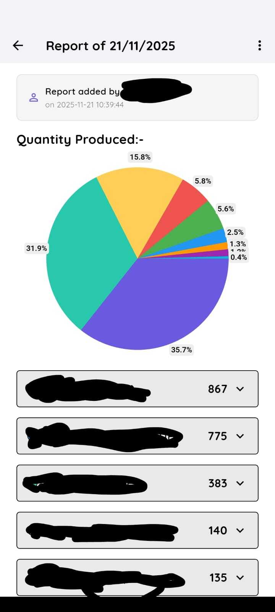
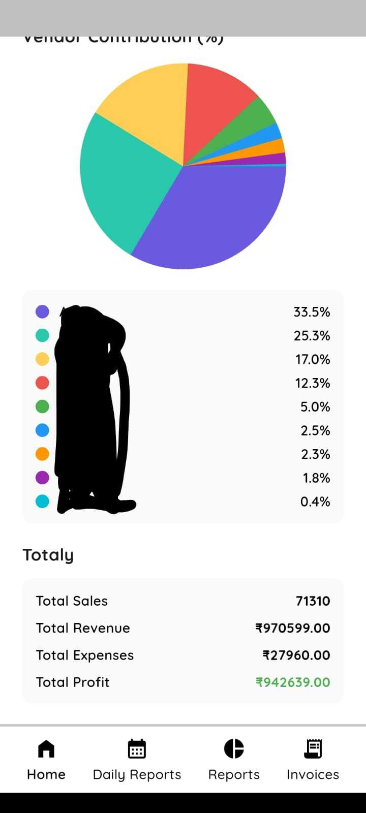
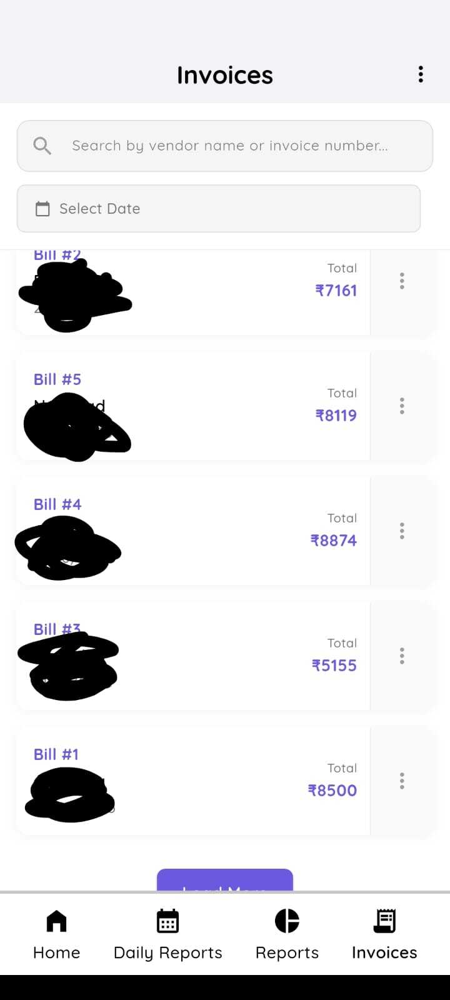

## Business Keeping

A production-ready Flutter application for small-business record keeping. It provides:

- Google Sign-In and Firebase Authentication
- Business configuration (items, vendors, expenses, contact info)
- Daily sales reporting with item/vendor breakdowns and expenses
- Aggregated reports over date ranges, with PDF export
- Invoice generation and management (Firebase Cloud Functions + Firebase Storage)
- Staff management with access windows and per-admin data scoping
- Push notifications (Firebase Cloud Messaging) with deep links to daily reports
- Local notifications for foreground messages

---

## Screenshots

<p align="center">
  
  &nbsp;&nbsp;
  
  &nbsp;&nbsp;
  
</p>
---

### Tech stack

- Flutter (Material 3, `google_fonts`, `table_calendar`, `pie_chart`)
- Firebase: Auth, Firestore, Storage, Messaging
- Local notifications: `flutter_local_notifications`
- PDF generation: `pdf`
- File access/open: `path_provider`, `open_file`
- HTTP: `http` (Firebase Cloud Functions endpoints)

---

## Quick start

Prerequisites:
- Flutter SDK and Dart SDK (pubspec targets Dart ^3.9.2; use a recent Flutter 3.x)
- A Firebase project with iOS/Android/Web apps configured

1) Install dependencies
```
flutter pub get
```

2) Configure Firebase (preferred: FlutterFire CLI)
```
dart pub global activate flutterfire_cli
flutterfire configure
```
This generates `lib/firebase_options.dart` and sets up platform configs.

**Note:** `firebase_options.dart` is in `.gitignore` as it contains project-specific configuration. Each developer must generate their own copy using `flutterfire configure`.

Also ensure:
- Android: place `android/app/google-services.json`
- iOS/macOS: add GoogleService-Info.plist in Xcode (Runner targets)

3) Run
```
flutter run
```

Builds:
```
flutter build apk   # Android
flutter build ios   # iOS (on macOS)
flutter build web   # Web (limited push support)
```

---

## Features overview

- Authentication: Google Sign-In via Firebase Auth (`AuthService`)
- Business config: set business details; define Items (name, code, price), Vendors, Expenses (`SettingsScreen`, `FirestoreService.saveUserConfig`) with Items under `configs/{uid}/items` subcollection
- Daily reports: create/edit per-date sales with item/vendor quantities, expenses, additional revenue, totals; handles deprecated items/vendors gracefully (`DailyReportEditScreen`, `FirestoreService.updateDailyReport`)
- Aggregated reports: generate date-range reports with charts and export to PDF (`ReportsScreen`, `ReportsDetailScreen`, `PdfService.generateAndSaveReport`)
- Invoices: generate via Firebase Cloud Functions endpoint, store PDFs in Firebase Storage, list/search/filter, download/open, and manage current bill number (`InvoiceService`, `InvoicesScreen`)
- Staff management: maintain staff emails and access windows; propagate vendors/items to staff docs; staff users report under the admin's UID (`StaffsScreen`, `FirestoreService.distribute*`, `isUserStaff`)
- Notifications: FCM initialization, token storage in `configs`, foreground local notifications, background handler, and deep-link navigation to a specific daily report date (`FCMService`, `firebase_messaging_background.dart`)

---

## Data model (Firestore)

- `configs/{uid}`
  - business_name, address, email, phone
  - vendors: string[]
  - expenses: string[]
  - special_pricing_vendors: string[]
  - special_prices: { [vendorName]: { [itemCode]: price } }
  - staffs_email: string[]
  - staffs_uid: string[]
  - fcm_token, fcm_token_updated_at
  - Subcollection `items`: docs with { name, code, price }

- `daily_sales/{uid}/{YYYY-MM-DD}/data`
  - items_sales: { [itemCode]: qty }
  - vendor_sales: { [vendorName]: { sale, revenue, items: { [itemCode]: qty } } }
  - expenses: { [expenseName]: amount }
  - addition_revenue, total_sales, total_revenue, total_expenses, net_profit
  - item_prices_snapshot: { [itemCode]: unitPriceAtTime }
  - For metadata: `daily_sales/{uid}/{YYYY-MM-DD}/metadata` with { exists, added_by, added_at }

- `total_report/{uid}`
  - Aggregated totals across dates; includes `dates_with_data` for calendar highlights

- `staffs/{staffUid}`
  - admin: string (admin UID)
  - vendors: string[]
  - items: array of maps (code->name pairs)
  - access_start_time, access_end_time

- `invoices/{uid}` (root doc)
  - bill_number: string | number (current sequence)
  - Subcollection `invoices`: invoice docs with vendor_name, date, items, total, bill_number
  - PDFs stored at `storage://invoices/{invoiceId}.pdf`

---

## Key modules (lib/)

- `main.dart`: Firebase initialization, FCM setup, `AuthWrapper` routing to sign-in vs `RootShell`
- `auth_service.dart`: Auth state stream, current user, sign-out
- `firestore_service.dart`: CRUD for configs, daily reports, totals, staff helpers, vendor/item distribution
- `fcm_service.dart`: Request permission, token store/refresh, local notifications, deep-link navigation
- `firebase_messaging_background.dart`: Background handler for FCM
- `invoice_service.dart`: Firebase Cloud Functions POST for invoice generation, PDF download/open
- `pdf_service.dart`: PDF export for aggregated reports
- `screens/`: UI for Sign-In, Home, Daily Reports, Reports, Invoices, Settings, Staff Management, etc.

---

## Notifications

FCM is integrated for Android/iOS and uses local notifications for foreground messages.

- Android manifest already includes required permissions and default notification icon/channel.
- Token is saved to `configs/{uid}.fcm_token` and kept fresh (`FCMService.validateAndUpdateToken`).
- Deep-link navigation: send a data payload like:
```
{
  "to": "<device_or_topic>",
  "data": { "screen": "daily_report", "date": "2025-06-15" },
  "notification": { "title": "Daily report", "body": "Open 2025-06-15" }
}
```
The app will open `DailyReportDetailScreen` for the given date on tap, even from a terminated state.

Notes:
- iOS requires APNs certificates/keys and Push/Background Modes enabled.
- Web push is not configured in this repo; additional service worker setup is required for FCM on web.

---

## Invoice generation

`InvoiceService.generateInvoice` sends a signed request (Firebase ID token) to your Firebase Cloud Function endpoint and expects a PDF URL string in response. The file is downloaded to app documents and opened with the platform handler.

**Setup:**
1. Deploy the Firebase Functions (see "Firebase Functions (Python)" section below)
2. Update `InvoiceService._baseUrl` in `lib/invoice_service.dart` with your deployed function URL
3. Ensure Firebase Storage rules allow reads for the generated PDFs (or signed URLs are returned)
4. On Android 13+, `POST_NOTIFICATIONS` permission may be prompted by the OS

---

## Platform setup

Android:
- `android/app/src/main/AndroidManifest.xml` contains permissions and default notification icon (`@drawable/ic_notification`). Replace this asset as needed.
- `google-services.json` is required under `android/app/`.

iOS/macOS:
- Add `GoogleService-Info.plist` to Runner targets, enable Push Notifications and Background Modes (Remote notifications).
- Configure APNs in Firebase console for Messaging.

Web:
- `lib/firebase_options.dart` includes web config; FCM requires a service worker and web push keys (not included here).

---

## Running tests

This repo contains a default Flutter widget test scaffold under `test/`. Add tests as needed:
```
flutter test
```

---

## Project structure

```
lib/
  auth_service.dart
  firestore_service.dart
  fcm_service.dart
  firebase_messaging_background.dart
  firebase_options.dart
  invoice_service.dart
  pdf_service.dart
  main.dart
  screens/
    sign_in_screen.dart
    root_shell.dart
    home_screen.dart
    daily_reports_screen.dart
    daily_report_detail_screen.dart
    daily_report_edit_screen.dart
    reports_screen.dart
    reports_detail_screen.dart
    invoices_screen.dart
    invoice_detail_screen.dart
    settings_screen.dart
    staffs_screen.dart

assets/
  screenshots/
    screen1.jfif
    screen2.jfif
    screen3.jfif
```

## Firebase Functions (Python)

The Python files in the root directory (`create_invoice.py`, `image_data_extraction.py`, `main.py`) contain the code for Firebase Cloud Functions. These handle:

- **Invoice generation**: PDF creation for business invoices (`generate_invoice`)
- **Image data extraction**: Processing and extracting data from images (`extract_data_from_image`, `process_openai_job`)
- **Other backend operations**: Supporting the Flutter app's functionality

### Setting up Firebase Functions

**Prerequisites:**
1. Install Firebase CLI: `npm install -g firebase-tools`
2. Login to Firebase: `firebase login`
3. Initialize Firebase Functions (if not already done):
```bash
firebase init functions
```
Select Python as the runtime when prompted.

**Deployment:**

1. Navigate to your project's functions directory (typically `functions/` in your Firebase project)
2. Copy the Python code from the root directory:
   - Copy `main.py` to your functions directory (or merge the function definitions into your existing `main.py`)
   - Copy `create_invoice.py` and `image_data_extraction.py` to your functions directory
3. Install Python dependencies:
```bash
cd functions
pip install -r ../requirements.txt
```
Or copy `requirements.txt` to the functions directory first.

4. Configure your function:
   - Place `serviceAccountKey.json` in your functions directory (for Firebase Admin SDK)
   - Update bucket names and other configuration as needed in the code

5. Deploy:
```bash
firebase deploy --only functions
```

6. After deployment, get your function URLs from:
   - Firebase Console > Functions > Copy the URL for each function
   - Or run: `firebase functions:config:get`

7. Update the Flutter app with your function URLs:
   - `lib/invoice_service.dart`: Update `_baseUrl` with your `generate_invoice` function URL
   - `lib/screens/staff_data_input_screen.dart`: Update the URL in the HTTP POST request (for staff data submission)
   - `lib/screens/staffs_screen.dart`: Update the URL in the HTTP POST request (for updating staff list)
   - `lib/screens/daily_report_edit_screen.dart`: Update both URLs:
     - `extract_data_from_image` function URL
     - `process_openai_job` function URL

**Note:** Each Firebase project will have unique function URLs. Do not commit hardcoded function URLs to version control. These placeholder URLs will cause errors until replaced with your actual deployed function URLs.

---

## Troubleshooting

- Firebase initialization errors: confirm `firebase_options.dart` matches your project and platform configs exist.
- Messaging token null: ensure notification permission was granted; call `FCMService.refreshToken()`.
- Deep links not navigating: verify `navigatorKey` is set in `MaterialApp` and payload includes `date`.
- Invoice download/open issues: check network connectivity, Storage rules, and platform file permissions.
- Charts empty: configure items/vendors/expenses in Settings and file at least one daily report.

---

## License
This project is licensed under the MIT License - see the [LICENSE](LICENSE) file for details.